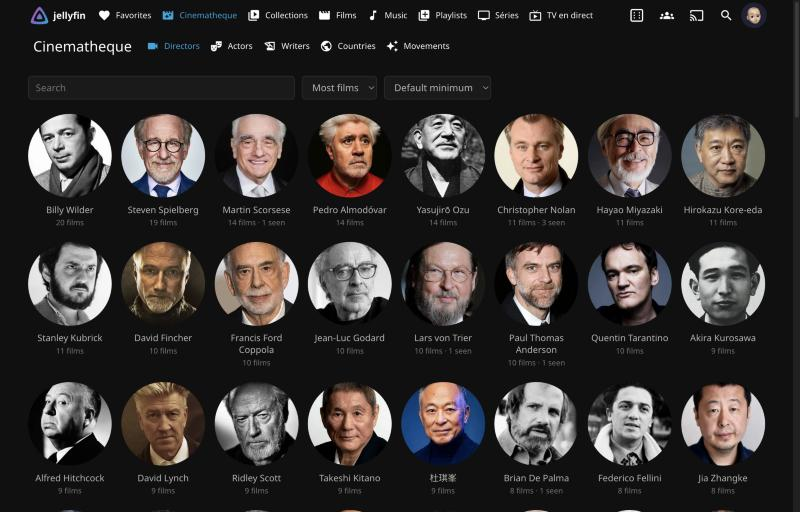
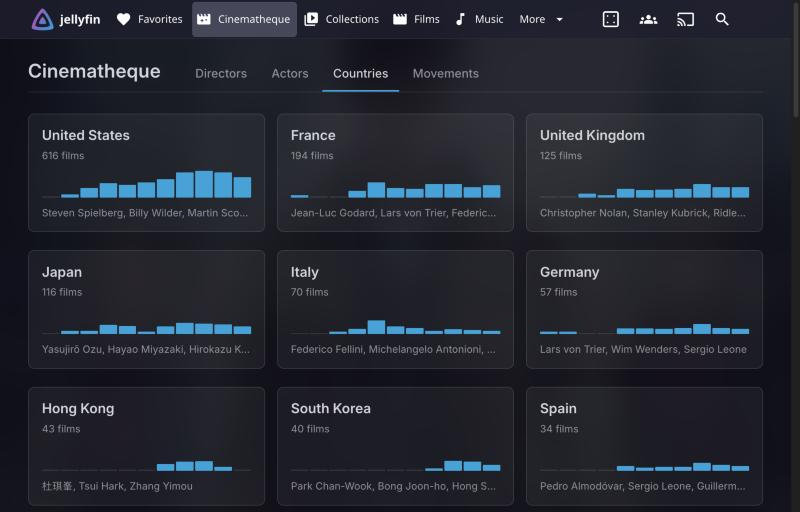
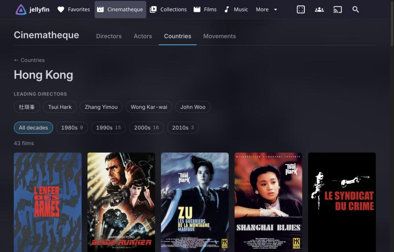
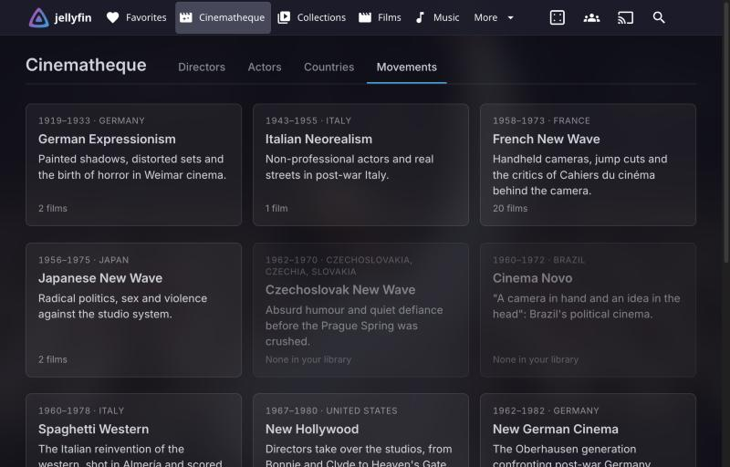
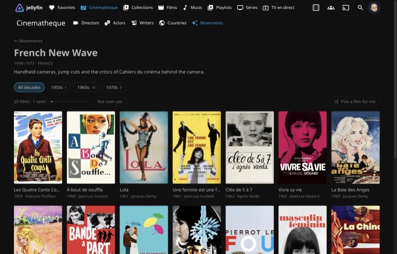

# Cinematheque

A Jellyfin plugin for film lovers. It adds a **Cinematheque** tab to the web client to
browse your film library the way a cinematheque programs it: by director, by actor,
by national cinema and by film movement.

[](https://github.com/gauthier-se/jellyfin-plugin-cinematheque/actions/workflows/ci.yml)
[](https://github.com/gauthier-se/jellyfin-plugin-cinematheque/releases/latest)
[](https://jellyfin.org)
[](LICENSE)



## Features

- **Directors.** Every director in your library with their portrait, number of films,
  active years and main countries. Open one to see their filmography in your library,
  oldest first, filterable by decade.
- **Actors.** The same for actors. Only the top of the bill counts (10 names per film by
  default), so the list shows leading players rather than every extra.
- **Screenwriters.** Jean-Claude Carrière, Suso Cecchi d'Amico, Charles Brackett: the same
  lists and filmographies for the people behind the script.
- **Countries.** National cinemas ranked by size, each with a decade histogram and its
  leading directors. Hong Kong, Japan, Italy, the Soviet Union: historical states stay
  separate from their successors. Co-productions count under every partner by default, or
  under their first listed country only, which keeps a Hollywood film with Hong Kong money out
  of Hong Kong cinema.
- **Movements.** Curated movements such as German Expressionism, Italian Neorealism, the
  French New Wave, the Japanese New Wave, the Hong Kong New Wave or Taiwan New Cinema,
  matched against your library by country, period and director. Administrators can edit
  them or add their own.

Everything respects each user's library access and parental controls. The interface is
available in English and French, and country names follow the user's language.

## Screenshots

| National cinemas | Hong Kong, by decade |
|:---:|:---:|
|  |  |
| **Film movements** | **The French New Wave** |
|  |  |

## Requirements

- Jellyfin **12.1**
- The [File Transformation](https://github.com/IAmParadox27/jellyfin-plugin-file-transformation)
  plugin, which lets plugins add to the web client without modifying its files.
  Without it the API still works, but the tab does not appear.
- Production countries in your metadata. The default TMDB provider fills them in;
  films without them only show up under directors and actors.

## Installation

1. In **Dashboard > Plugins > Repositories**, add both repositories:
   - File Transformation: `https://www.iamparadox.dev/jellyfin/plugins/manifest.json`
   - Cinematheque: `https://gauthier-se.github.io/jellyfin-plugin-cinematheque/manifest.json`
2. In **Catalog**, install **File Transformation**, then **Cinematheque**.
3. Restart the server, then reload the web client.

The tab appears next to **Favorites** in the header of the modern layout, and under
**Home** in the navigation drawer on small screens and in the legacy layouts (desktop,
mobile and TV).

### Manual installation

Download the zip from the [latest release](https://github.com/gauthier-se/jellyfin-plugin-cinematheque/releases/latest),
extract it into a `Cinematheque_<version>` folder inside your Jellyfin `plugins` directory
(`/var/lib/jellyfin/plugins` on Debian), and restart the server.

## Configuration

**Dashboard > Plugins > Cinematheque** sets how many actors per film count, the default
minimum number of films for the people lists, and the movements.

A movement is a JSON object. A film belongs to it when its TMDB id is listed in `TmdbIds`,
or when it matches every rule that is set:

```json
{
  "Id": "shaw-brothers-wuxia",
  "Name": "Shaw Brothers wuxia",
  "Description": "Swordplay epics from the Shaw Brothers studio.",
  "Countries": ["HK"],
  "YearFrom": 1965,
  "YearTo": 1985,
  "Directors": ["Chang Cheh", "King Hu", "Chor Yuen", "Lau Kar-leung"],
  "Genres": ["Action"],
  "Tags": [],
  "TmdbIds": []
}
```

- `Countries`: ISO codes (`HK`) or English names (`Hong Kong`); any of them qualifies.
- `YearFrom` and `YearTo`: inclusive bounds; either can be left out.
- `Directors`: any of them qualifies. Write a name, a TMDB person id (`tmdb:25236`) or both
  (`Johnnie To (tmdb:25236)`). The id matches the person whatever script their credits use,
  such as `杜琪峯`; names are compared without accents or punctuation, so `Nagisa Oshima`
  matches `Nagisa Ōshima`.
- `Genres`, `Tags`: any of them qualifies, compared like names.
- An empty list means "no rule". A movement with no country, director, genre or tag rule
  only matches its `TmdbIds`.

## API

The tab is a client for a small REST API, available to any authenticated user:

| Endpoint | Description |
|----------|-------------|
| `GET /Cinematheque/People/{role}` | People in a role (`directors`, `actors`, `writers`), with `search`, `minFilms`, `sortBy` (`count` or `name`), `startIndex`, `limit` |
| `GET /Cinematheque/Countries` | Countries with film counts, decades and leading directors; `primaryOnly` counts each film under its first country |
| `GET /Cinematheque/Movements` | Movements with film counts |
| `GET /Cinematheque/Films` | Films filtered by `country` (with `primaryCountry`), `person` (a key such as `tmdb:25236`, or a name) with `role`, `movement`, `decade`, `unseen` |
| `GET /Cinematheque/Films/Random` | One film picked among the same filters, preferring films the user has not watched |

## How it works

The server side builds an in-memory catalog of the films each user can see, from Jellyfin's
own metadata: production locations, people and genres. It is rebuilt after any library change.

On the web side, File Transformation adds one script tag to `index.html`. That loader adds the
tab to whichever layout is active and loads the app when the tab is opened. The app lives on
the home route (`#/home?cinematheque=directors`), so the header, drawer, back button and
bookmarks all keep working without registering a route in jellyfin-web.

## Development

The repository ships a Nix devshell with the .NET 10 SDK and Node.js:

```sh
nix develop
dotnet build
dotnet test
```

Without Nix, install the .NET 10 SDK. See [CONTRIBUTING.md](CONTRIBUTING.md) for testing against
a real server.

## License

[GPL-3.0](LICENSE), like Jellyfin and most of its plugins.

Cinematheque is not affiliated with the Jellyfin project or with any film archive.
